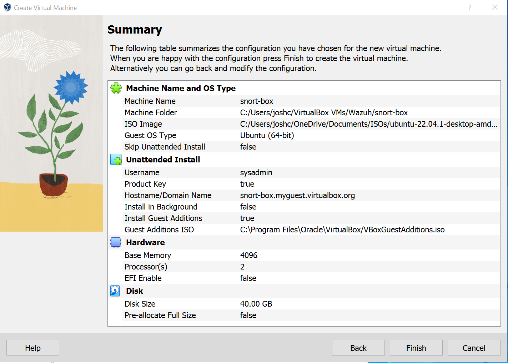
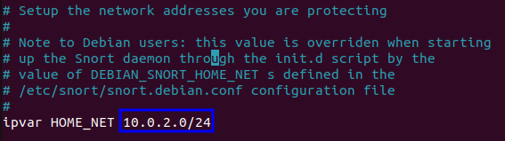

# Splunk-Snort-SIEM

<h1>Splunk SIEM with Snort IDS</h1>

<h2>Lab Description:</h2>

In this Repository you will find instructions on how to deploy a Splunk SIEM with logs forwarded from a Snort IDS. In walk through lab you will find each step to configure the enviroment.
> 
    ADD COMPLETION PHOTOS

<h2>Installation and configuration of Snort</h2>

In this section we will deploy a linux machine that properly runs Snort
 

Note prerequisites: virtual box installed and a copy of Ubuntu 22.0.04 ISO

Iso can be downloaded here: https://ubuntu.com/download/desktop

1. Create virtual machine with at least 2 CPU and 4 GB RAM
   
2. Update and Upgrade machine:
   - sudo apt update && upgrade -y
3. Before the next step know your interface name and your IP address range. You will be required to enter them following the next step.
4. Install snort with the following command:
   - sudo apt-get install snort -y
   When promted enter you address range and interface name
5. Now we need to edit the snort configuration file to add the ip range.
   - sudo nano /etc/snort/snort.conf
    

